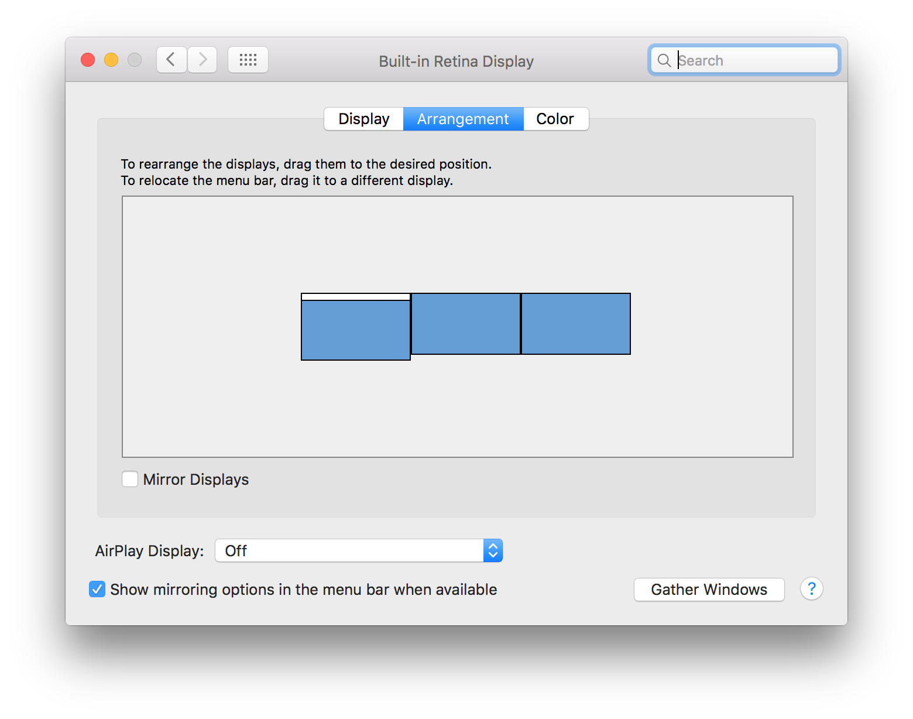

# Hardware Setup

## ProPresenter

We use two laptops for ProPresenter: a master computer running ProPresenter's
Master Control Module and a slave computer which is connected to the master
computer over the network. The master computer contains the slides and video
for projection in the auditorium, and the slave computer contains the slides
and video for the live stream. We are set up this way in order to accomodate
for our limited projection setup: we project at a resolution of 1920x650 and
stream at a resolution of 1920x1080.

### Display

The display settings on the master ProPresenter computer should be that both
the projector and TV are *not* mirrored and both running at a resolution of
1920x1080 (1080p) (while the project is set to 1920x1080, the bottom 1920x430
section is solid black which makes the effective projection resolution
1920x650).

## Streaming and Video Switching

We use a hardware video switcher which outputs to a dedicated hardware streamer
which stream to Vimeo which in turn streams to Facebook and YouTube. The slave
ProPresenter computer feeds slides and video specially designed for the live
stream to the video switcher.

## LightKey

We use LightKey on a dedicated computer to run lights over Art-Net. We have an
Art-Net DMX interface which runs on the network.

## Diagram

