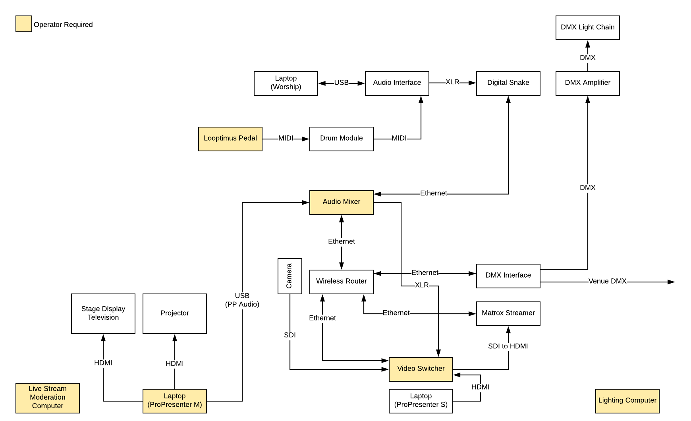

# Production Operations Overview

## Slides and Live Audio/Visual

We use ProPresenter to control slides as well and video and music. Our
ProPresenter setup currently involves two computers running ProPresenter: one
for projection in the auditorium and one for the live stream. This allows us to
work with our projection limitations (we are effectively limited to projecting
at a resolution of 1920x650) while not compromising with streaming (slides and
video can be full 1080p).

Other advantages of using the separate ProPresenter instance for live streaming
include:

* Messages (child needs attention, headlights on, etc) can be projected in the
  auditorium but do not affect the live stream.
* We can add more computers for future ambitions; e.g., we can set up separate
  rooms with slides in different languages.

## Live Streaming

We use a hardware video switcher and a dedicated hardware video streamer for
our live stream. Currently we have one camera and the second ProPresenter
computer feeding into the switcher. The switcher main program SDI output goes
into an SDI to HDMI converter which in turn goes into the hardware streamer.
The hardware streamer additionally creates a local recording on an SD card for
backup purposes.

We use Vimeo as a streaming distribution hub. Events are scheduled individually
on Facebook and YouTube and then the stream keys for each platform are entered
into Vimeo. Vimeo then gives us its own stream key which we enter into the
hardware streamer.

Currently our live stream appears on Facebook and YouTube. We are currently
working on being able to additionally embed our live stream on our website.

## Audio

Audio is mixed on an Allen & Heath Qu-32 mixer. Source of audio include,
instruments and microphones (over d-snake and wireless) as well as ProPresenter
over USB via Audio Hijack.

We also run drums, backing track, and click track off of a laptop on stage.
This laptop has its own audio interface and is plugged into the d-snake with
all the other instruments.

## Lights

We use LightKey for controlling lights.

## Setup Diagram

