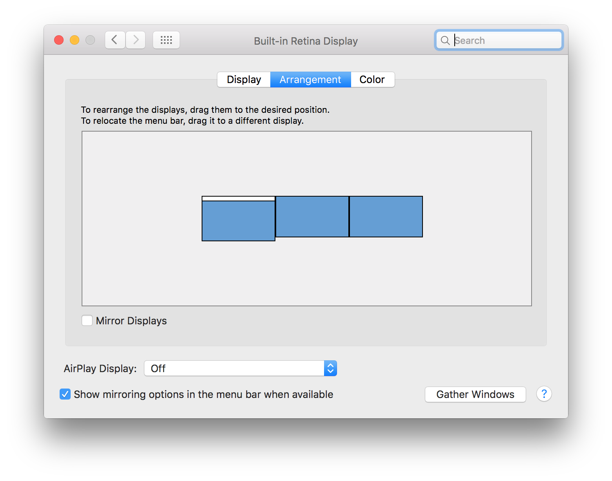
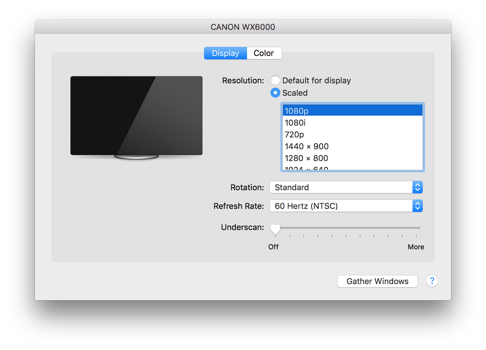
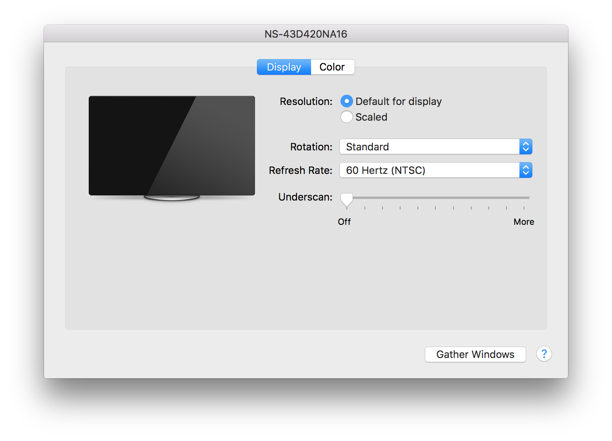
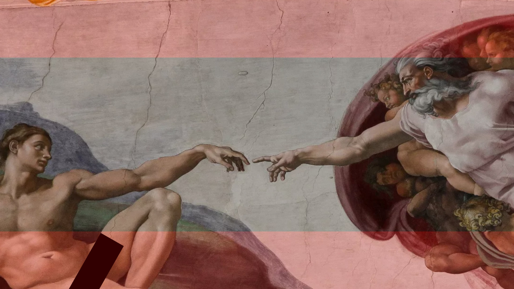

# ProPresenter

We use ProPresenter for our slides as well as audio/visual cues during service.

## Operation

### Only Click Once

If it appears that something is taking a while to load after you click it, do
not click again! Only one click is required and clicking multiple times will
cause stuttering.

### Useful Keyboard Shortcuts

| Shortcut | Action                         |
| -------- | ------------------------------ |
| `cmd+1`  | Toggle Output                  |
| `cmd+2`  | Toggle Stage Display           |
| `cmd+3`  | Toggle Stage Display Preview   |
| `F1`     | Clear Everything (Blackout)    |
| `F6`     | Clear Everything (Go to Logo)  |
| `F2`     | Clear Slide (Leave Background) |
| `F3`     | Clear Background               |
| `F4`     | Clear Props                    |
| `F5`     | Clear Audio                    |

## Setup

### Master Instance

The master instance of ProPresenter is what powers the main auditorium
projection. We project at full 1080p but the bottom 1920x430 section is just
solid black. Our effective projection is 1920x650. This setup allows us to use
the area of the stage that is below the projection screen. There is also a TV
on top of the booth which acts as a stage display (clocks, timers, videos,
etc).

The display settings on the master ProPresenter computer should be that both
the projector and TV are *not* mirrored and both running at a resolution of
1920x1080 (1080p).







The output should be configured to go to the projector and the stage display
should be configured to go to the TV.


```
Placeholder: Network settings
```

```
Placeholder: Audio Hijack
```

### Slave Instance

```
Placeholder: Network settings
```

```
Placeholder: Audio Hijack
```

### Media Prep

#### Videos

The following `ffmpeg` command will prepare videos for our projection setup:

```
ffmpeg -i input.mp4 -filter:v "scale=1920:1080, crop=1920:650:0:215, pad=1920:1080:0:0" output.mp4
```

Breaking it down:

1. `ffmpeg -i input.mp4` - `ffmpeg` will read the video file `input.mp4`.
1. `-filter:v "` - Specify video filters for `ffmpeg`.
1. `scale=1920:1080, ` - Scales the video to `1080p`. Lots of videos are still
   `720p`. This is not necessary when working with a video that is already
   `1080p`.
1. `crop=1920:650:0:215, ` - Crops the video to `1920x650` (our visible
   projection resolution) cutting off the top and bottom `215` pixels. `0:215`
   specifies the top-left corner of the crop box.
1. `pad=1920:1080:0:0" ` - Pads the video back out to `1080p` placing black
   bars in the remaining space. `0:0` specifies putting the video in the
   top-left corner of the resulting `1080p` image, leaving `430` pixels of
   black bar on the bottom.
1. `output.mp4` - Tells `ffmpeg` to write the resulting video file to
   `output.mp4`.

##### Pillar Box

Alternatively, use the following `ffmpeg` command to pillar-box a video for our
projection setup:

```
ffmpeg -i input.mp4 -filter:v "scale=1156:650,pad=1920:1080:382" output.mp4
```

#### Slides

We have two targets for slides. One is the auditorium projection, set up for
1920x650 (shorter than standard 1080p). The other target is the live stream,
which is full 1080p. To accomodate for these two targets, slides should be
designed in Keynote in full 1080p resolution with 215px buffers on the top and
bottom. The middle 650px is a safe area for text and important picture details.
See the following example slide (red buffer zones for illustrative purposes
only, they are not required in actual slide designs):



With slides set up as such we will prepare two sets of images. The first will
be the full slide graphics for the live stream. The other will be the middle
section cropped out for projection in the auditorium.

Given a Keynote file set up properly as such, the first step is to export the
slides to images. Open the Keynote file and go to `File > Export To... >
Images`. Choose to export all slides with an image for each stage of builds in
`PNG` format. We do not want to use `JPEG` for slide graphics. Choose any
directory for output. The images output by this step are the full images which
will be used for the live stream.

Now we have to generate the cropped images for projection in the auditorum. The
easiest way to do this is to use [ImageMagick]. Open a terminal in the
directory where the slide images are located and run the following commands:

```
mkdir -p padded
magick '*.png[1920x650+0+215]' -gravity north -background black -extent 1920x1080 'padded/%03d.png'
```

The first command will create a directory called `padded` to export the
cropped/padded images to. The second command will crop out the middle section
of the images (1920x650 starting at `(0,215)`) and then grow the images back
out to 1080p with the cropped contents pushed to the top of the frame leaving
the bottom 430px solid black. The images will be output to `padded/000.png`,
`padded/001.png`, `padded/002.png`, etc.

[ImageMagick]: https://www.imagemagick.org/script/index.php "ImageMagick"
