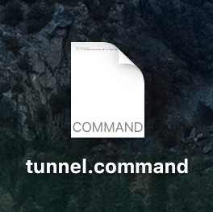

# ProPresenter

Display setup, midi setup.

## Operation

### Only Click Once

If it appears that something is taking a while to load after you click it, do not click again! Only one click is required and clicking multiple times will cause stuttering.

### Useful Keyboard Shortcuts

| Shortcut | Action                         |
| -------- | ------------------------------ |
| `cmd+1`  | Toggle Output                  |
| `cmd+2`  | Toggle Stage Display           |
| `cmd+3`  | Toggle Stage Display Preview   |
| `F1`     | Clear Everything (Blackout)    |
| `F6`     | Clear Everything (Go to Logo)  |
| `F2`     | Clear Slide (Leave Background) |
| `F3`     | Clear Background               |
| `F4`     | Clear Props                    |
| `F5`     | Clear Audio                    |


## Display Setup

The output should be configured to go to the projector and the stage display should be configured to go to the TV.


## Midi Setup

Leave all midi notes the way they are for portability. Dealing with the midi notes will be covered in [Recording Slide Automation](recording-slide-automation.md).

## Remote Control

As a portable church we hold service in venues where we do not control the network. As a result, we are not typically able to remote-control ProPresenter over WiFi. That said, given a Linux server hosted somewhere on the Internet, we can tunnel the ProPresenter port to a public IP address. For example:

```sh
ssh -i $PRIVATE_KEY -nNT -R $REMOTE_PORT:localhost:$LOCAL_PORT $REMOTE_USER@$REMOTE_IP
```

For a full explanation of that command, click [here][explain-ssh].

From there, you can connect using the ProPresenter iOS or Android app at `$REMOTE_IP` on `$REMOTE_PORT`.

This command, pre-configured and ready to go, is available on the ProPresenter computer's desktop as an icon:



Simply double click that icon and a terminal window will launch and run the command.

## Weekly Setup Checklist

* [ ] Songs
* [ ] Announcements Video
* [ ] Bumper Video
* [ ] Message Slides

[explain-ssh]: http://explainshell.com/explain?cmd=ssh+-i+%24PRIVATE_KEY+-nNT+-R+%24REMOTE_PORT%3Alocalhost%3A%24LOCAL_PORT+%24REMOTE_USER%40%24REMOTE_IP "ssh -i $PRIVATE_KEY -nNT -R *:$REMOTE_PORT:localhost:$LOCAL_PORT $REMOTE_USER@$REMOTE_IP"
