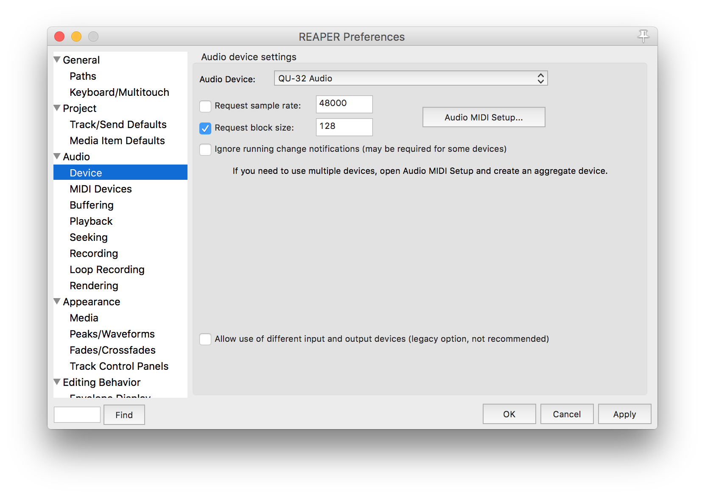
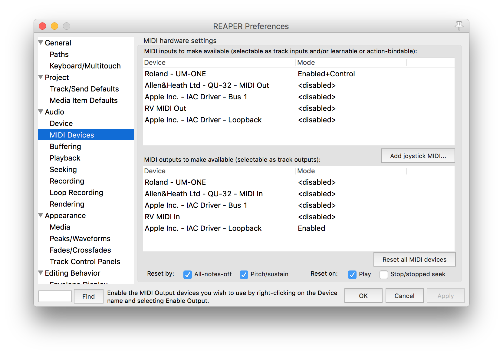
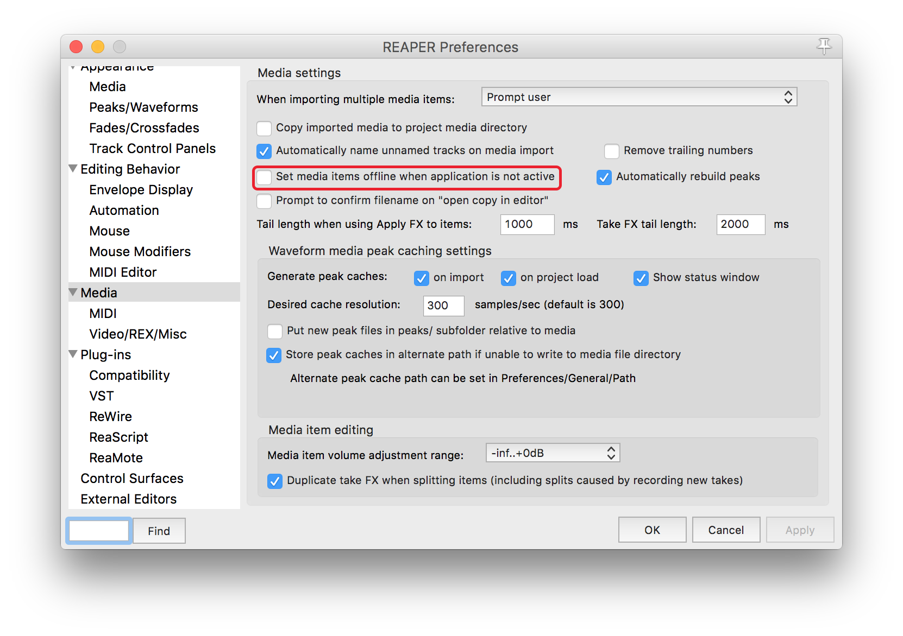
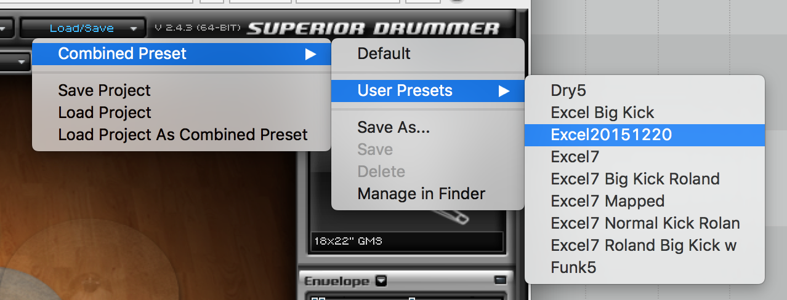
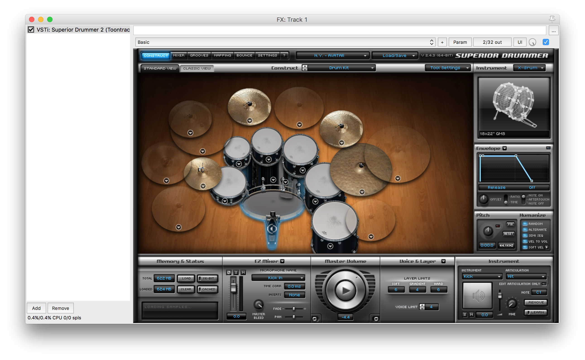
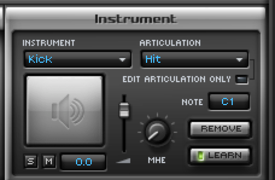

# Reaper

We use Reaper for playing backing tracks during worship and as a host for
Superior Drummer (used for drum sounds).

## Settings

### Audio Device

The Audio Device should be set to the Allen & Heath Qu-32 and should be set to
request a block size of 128.



### Midi Devices

Enable input from the Roland UM-ONE mk2 and output to the IAC Loopback device.



### Media Settings

Media items should *not* be set to offline when Reaper is not active.



## Superior Drummer

### Track Setup

The track for the drums in Reaper should be set up to:

1. Record (and monitor) input for Channel 10 from the Roland UM-ONE mk2 midi interface.
1. Output to the proper channel on the Allen & Heath Qu-32.

```
image placeholder: track setup
```

We have presets with all Midi notes pre-mapped and instruments set up. Our
current preset is called `Excel20151220`:



When properly set up, Superior Drummer should look as such:



### Remapping

Remapping a note from the drum kit to play a certain instrument can be done
through the following process:

1. Right click the instrument to map a MIDI note to.
1. Check the `learn` box.
1. Play the note on the drum kit.
1. The `learn` box should become unchecked and that note on the drum kit should trigger that instrument.



## Playtime for Reaper

Coming soon.
