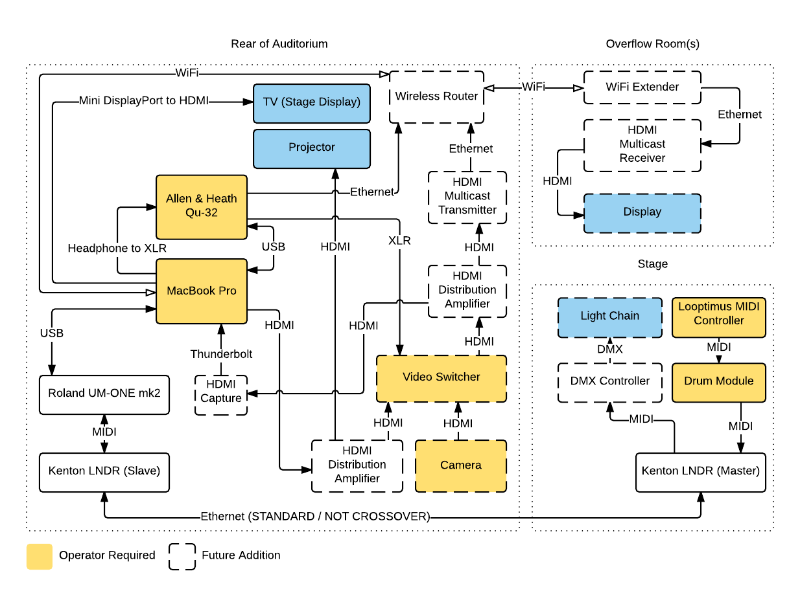

# Hardware Setup

## Summary

We use the following hardware for each service:

* Computer (Mid-2012 MacBook Pro Retina)
* Mixer (Allen & Heath Qu-32)
* MIDI Controller (Looptimus)
* Drum Module (Roland TM-12)
* MIDI Snake (Kenton LNDR)
* MIDI Interface (Roland UM-ONE mk2)
* PC-DI
* Projector (Venue)
* TV (Stage Display)

## Computer

We use a Mid-2012 MacBook Pro Retina as our primary (and currently only) computer. This computer has enough connectivity built in to connect to up to three external displays and supports the Midi features of ProPresenter. We also use this computer for recording audio and plan to use it in the future for controlling lights and streaming services to the Internet.

### Settings

Display, midi studio, do not disturb.

#### Display

The display settings should be that both the projector and TV are not mirrored and both running at a resolution of 1920x1080 (1080p).

#### MIDI Studio

A loopback MIDI device needs to be set up to allow communication between ProPresenter and REAPER.

#### Do Not Disturb

The computer should be placed in "Do Not Disturb" mode. This mode can be set by opening the notification center, scrolling up, and settings "Do Not Disturb" to `on`.

## Setup

### Presentation / Projection

We connect the computer to two external displays:

1. HDMI to Projector
1. Mini DisplayPort to HDMI to TV

### Control / Drums

On stage we use a MIDI controller to control the playback of backing tracks, click / guide tracks, and to control the projection of lyrics. There is also a drum module on stage which produces its own MIDI signal.

The MIDI controller is connected via a MIDI cable to the drum module. The drum module is connected via a MIDI cable to the master end of the Kenton LNDR MIDI snake. At the slave end of the snake we use a Roland UM-ONE mk2 to feed MIDI into the computer and send MIDI from the computer.

### Audio / Recording

The Allen & Heath Qu-32 mixer is connected to the computer via a USB cable. We use this connection to send audio from the computer (drum sounds, backing tracks, and guide tracks) and to record all audio from the mixer.

We additionally connect the computer's primary audio output via headphone jack to a PC-DI box which then connects via XLR to the mixer.

### Diagram 

